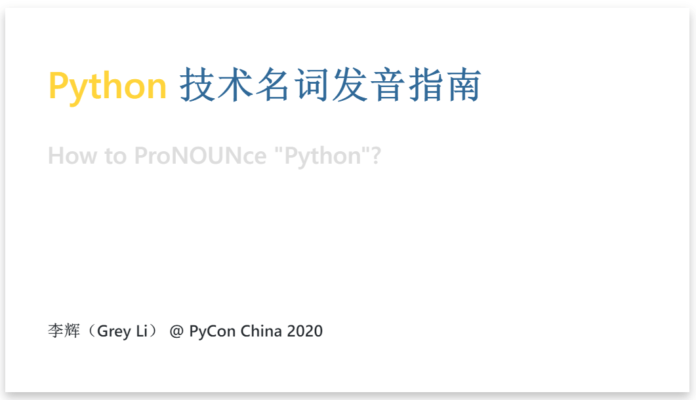

# How to ProNOUNce "Python"?

Python 技术名词发音指南 @ PyCon China 2020 11/29 13:40

- Slides: https://greyli.com/pronounce-python
- Video: [YouTube](https://youtu.be/TiAYPxrZGFI) | [bilibili](https://www.bilibili.com/video/BV17K411375V/)
- Feedback: https://github.com/greyli/pronounce-python/issues

If you want to generate HTML format of the slides locally, you can use [Marp CLI](https://github.com/marp-team/marp-cli).
