

<h1 style="font-size: 70px">Python 技术名词发音指南</h1>
<h2 class="grey"> How to ProNOUNce "Python"?</h2>

     

#### 李辉（Grey Li） @ PyCon China 2020

---

# 李辉 / Grey Li

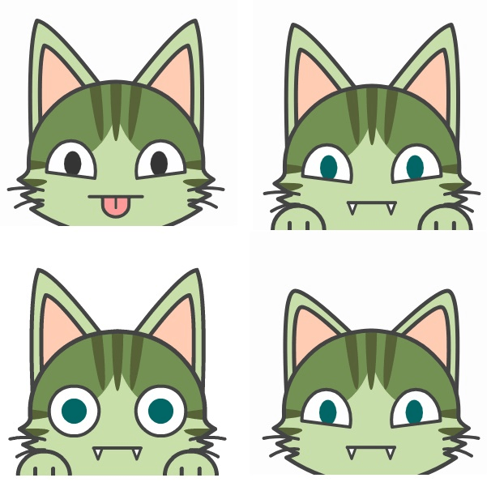  

- Web Developer
- Flask Maintainter
- Microsoft MVP
- [HelloFlask](https://helloflask.com) Creator
- GitHub [@greyli](https://github.com/greyli)
- 《[Flask Web 开发实战](https://helloflask.com/book/1)》

##### find more on [greyli.com](https://greyli.com)

---
## Python Web API 设计与开发

  

helloflask.com/book/2

广告

x

---
<!-- _class: invert -->

# 重要的事情说三遍
##### PyCon China 2018 + PyCon China 2019 + PyCon China 2020

---

## PyCon China 2018 x **1**

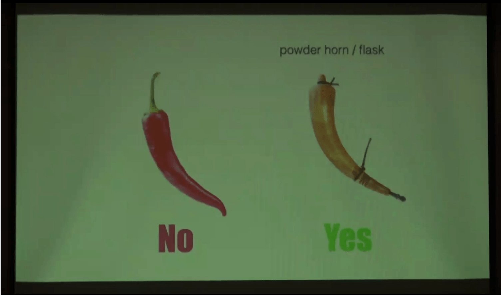

---

## PyCon China 2019 x **2**

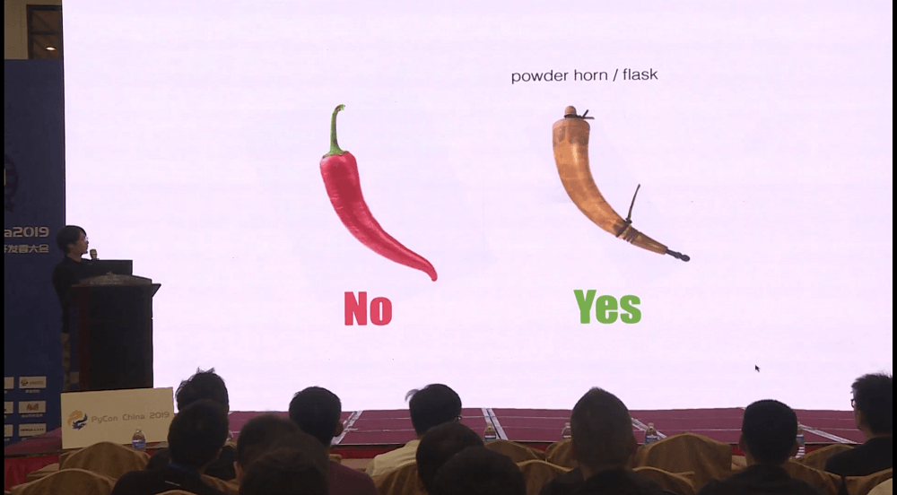  

---

## PyCon China 2020 x **3**

  

---

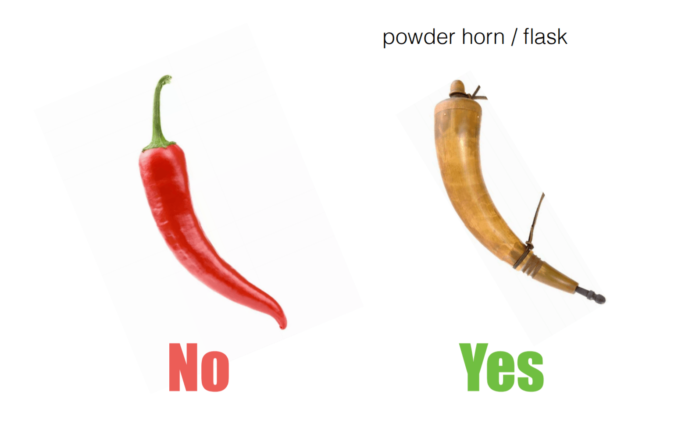  

---

## Flask 大中华区品牌形象宣传大使<small>（自封）</small>的任务清单
 

<ul>
<li><strong>科普 Flask logo 的正确含义 x 3</strong> ✅</li>
</ul>

---

## PyCon China 2018 x **1**

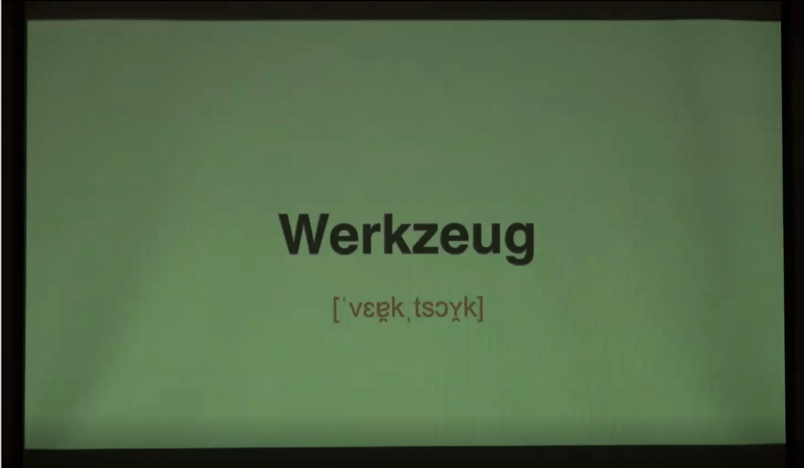  

---

## PyCon China 2019 x **2**

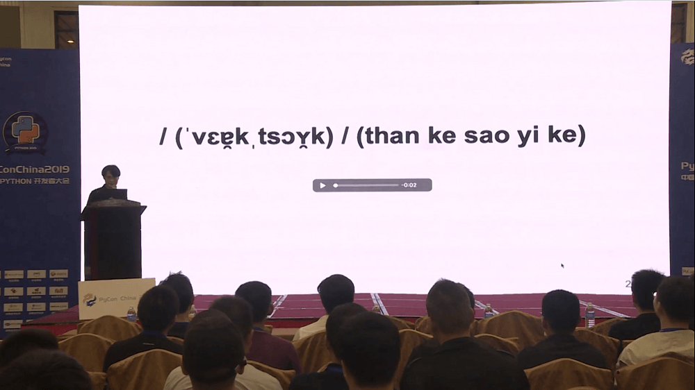  

---

## Flask 大中华区品牌形象宣传大使<small>（自封）</small>的任务清单
 

<ul>
<li><del>科普 Flask logo 的正确含义 x 3</del></li>
<li><strong>科普 Werkzeug 的正确发音 x 3</strong> ✅</li>
</ul>

---

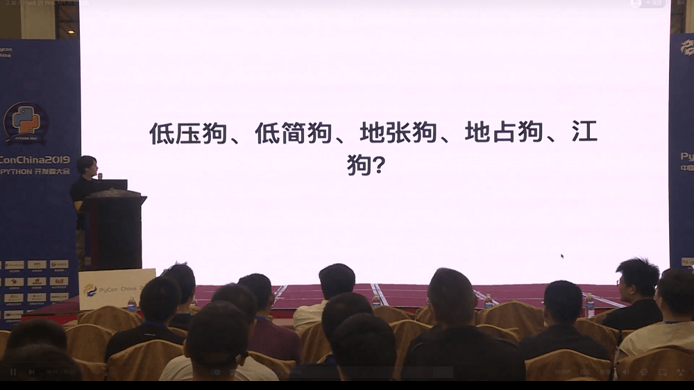

---

## Flask 大中华区品牌形象宣传大使<small>（自封）</small>的任务清单
 

<ul>
<li><del>科普 Flask logo 的正确含义 x 3</del></li>
<li><del>科普 Werkzeug 正确发音 x 3</del></li>
<li><strong>大力推广 Django 的错误发音<small>（误）</small></strong> ✅</li>
</ul>

---

<!-- _class: invert -->

# 减少 Python 社区因为错误的技术名词发音产生的熵
##### 促进程序员、演讲者、培训班老师对正确发音的重视

---

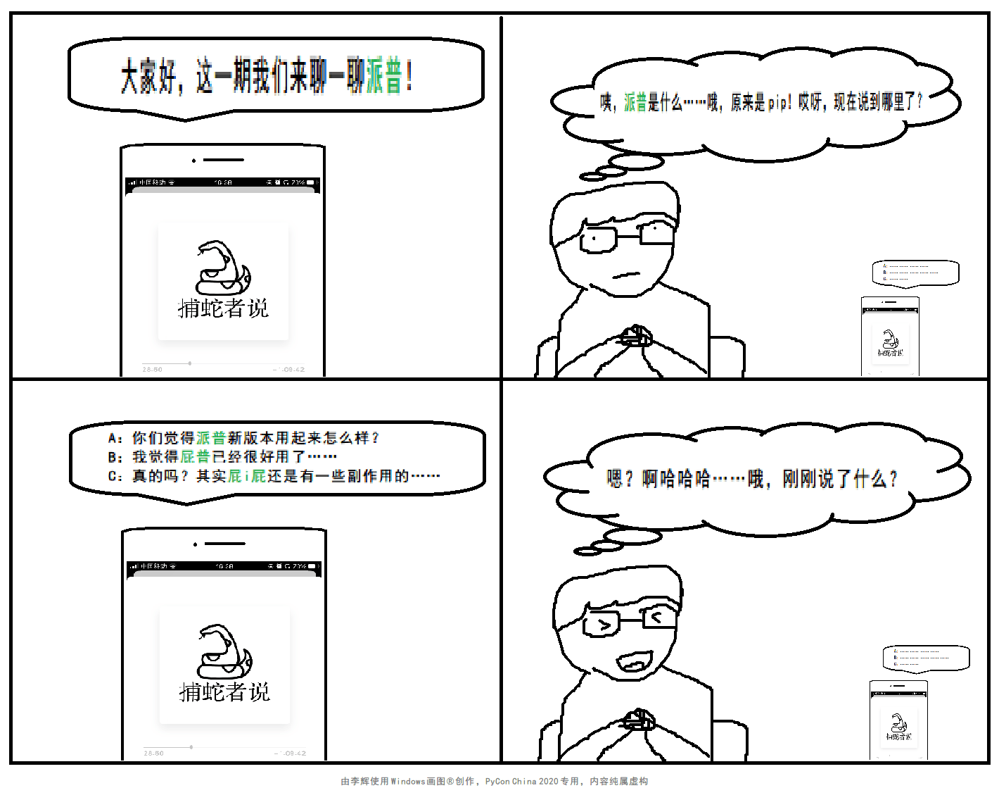

---

<!-- _class: invert -->

# 我的英语水平怎么样？
##### fabulous: 极好的；绝妙的；很大的；巨大的

---

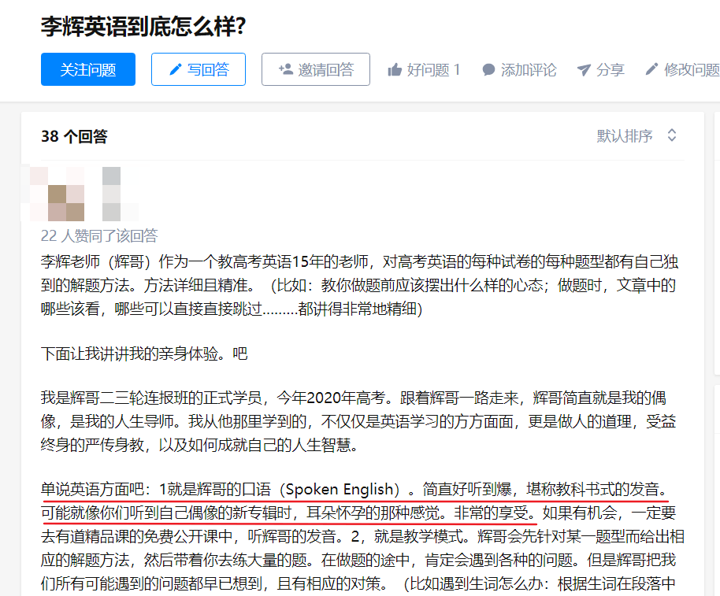

---

## Python

> When he began implementing Python, Guido van Rossum was also reading the published scripts from “Monty **Python**’s Flying Circus” ... so he decided to call the language Python. [source](https://docs.python.org/2/faq/general.html#why-is-it-called-python)

- UK
  - pai·thn
  - /ˈpaɪ.θən/

- US
  - pai·thaan
  - /ˈpaɪ.θɑːn/

 

demo: [Google](https://www.google.com/search?q=how+to+pronounce+python) | [YouTube](https://www.youtube.com/watch?v=YgtL4S7Hrwo&start=142) | [bilibili](https://www.bilibili.com/video/BV1BJ411u7U9)

---

<h1 class="root">[<strong>py</strong>]</h1>

- pie
- /paɪ/
- <audio src="audios/pie.mp3" controls=true></audio>

---

## **Py**Con

##### **Py**thon  **Con**ference
- /'**paɪ**θɑn/ /'**kɑn**f(ə)rəns/
- /'paɪkɑn/
- demo: [YouTube](https://www.youtube.com/watch?v=ThLpG6o6zoM?start=05) | [bilibili](https://www.bilibili.com/video/BV13Q4y1T7ra)

---

## **Py**PI
##### **Py**thon **P**acakge **I**ndex

> "PyPI" should be pronounced like "**pie pea eye**", specifically with the "PI" pronounced as individual letters, rather as a single sound. This minimizes confusion with the PyPy project... [source](https://pypi.org/help/#pronunciation)

- PyPI: /paiˈpiˈaɪ/
- PyPy: /paiˈpai/

---

## **Py**PA
##### **Py**thon **P**ackaging **A**uthority

> 没人知道它怎么读…… [source](https://pythonhunter.org/episodes/ep15#t=00:02:57)

- pie-P-A
- /paiˈpiˈeɪ/

---

## **Py**Qt

> Qt (**pronounced as "cute", not "cu-tee"**) is a cross-platform... [source](https://wiki.qt.io/Qt_for_Beginners#Introduction_to_Qt)

- pie-cute
- /paɪˈkjuːt/

---

## py 组合词

* **Py**GTK (**G**IMP **T**ool**K**it)
* **Py**dantic (Pe**dantic**, /pə'**dæntɪk**/)
* **Py**Torch
* Num**Py** (**Num**ber, /'**nʌm**bər/)
* Sci**Py** (**Sci**ence, /'**saɪ**əns/)
* Cherry**Py**
* HTT**Pie**
* web2**py** (two)
* web.**py** (dot)

---

## Exceptions

- Scrapy
  - Scrape -> Scrapy 
  - /ˈskreɪpi/
  - <audio src="audios/scrapy.mp3" controls=true></audio>

- Pyramid
  -  /'pɪrəmɪd/
  -  <audio src="audios/pyramid.mp3" controls=true></audio>

---

<h1 class="root">[<strong>env</strong>]</h1>

- **env**iroment
- /**ɪn'v**aɪrənmənt/
- /ɪn'v/

---

## env 组合词

* py**env**
* virtual**env** /'vɜrtʃuəl/
* virtual**env**wrapper
* dot**env**
* auto**env**
* v**env**

---

<h1 class="root">[<strong>pip</strong>]</h1>

- /pɪp/
- <audio src="audios/pip.mp3" controls=true></audio>

---

## pip 组合词

* **pip**env
* **pip**x
* **pip**reqs (**req**uirement /**rɪ'k**waɪrmənt/)
* **pip**deptree (**dep**endency, /**dɪ'p**endənsi/)
* **pip**-tools

---

# Unicorn

- /'junɪ.kɔrn/
- <audio src="audios/unicorn.mp3" controls=true></audio>

---

## Gunicorn

> Gunicorn '**G**reen **Unicorn**' is a Python WSGI HTTP Server for UNIX. It's a pre-fork work ... [source](https://gunicorn.org/)

  

- gee-unicorn
- /dʒi/-/'junɪ.kɔrn/
- gevent
- P.S. Nginx (engine X)
- <audio src="audios/nginx.mp3" controls=true></audio>

---

##  Uvicorn 

> Uvicorn is a ... ASGI server implementation, using **uv**loop... [source](https://www.uvicorn.org/)

  

- U-V-/kɔrn/
* uvloop (uvloop is implemented in Cython and uses lib**uv**...)
* UV?

---

## **U**nicorn **V**elociraptor (独角迅猛龙)

  

---

# Not English

---

## Werkzeug (German)

> werkzeug German noun: "tool". Etymology: werk ("work"), zeug ("stuff") [source](https://palletsprojects.com/p/werkzeug/)

- /ˈvɛrkʦɔyk/
- <audio src="audios/werkzeug.mp3" controls=true></audio>

  

---

## Jinja (Japanese)

> The name Jinja was chosen because it’s the name of a Japanese temple and temple and template share a similar pronunciation. It is not named after the city in Uganda. [source](https://jinja.palletsprojects.com/en/2.11.x/faq/#why-is-it-called-jinja)

- <audio src="audios/jinja.mp3" controls=true></audio>

  

---

## Vibora (Portuguese)

> Before you ask, Vibora means Viper in Portuguese :) [source](https://github.com/vibora-io/vibora)

- /ˈvi.bo.ɾa/
- <audio src="audios/vibora.mp3" controls=true></audio>

  

---

# Three men and Three Cats 🐱

---

## IDLE

> IDLE is Python’s **I**ntegrated **D**evelopment and **L**earning 
> **E**nvironment [source](https://docs.python.org/3/library/idle.html)

> Eric Idle ... is an English actor, comedian ... former member ... Monty Python ... [source](https://en.wikipedia.org/wiki/Eric_Idle)

> IDLE is named in honour of Monty Python member Eric **Idle** ([?](https://stackoverflow.com/questions/21581564/origin-of-the-names-python-and-idle)).

- /'aɪd(ə)l/
- <audio src="audios/idle.mp3" controls=true></audio>

  

---

## Django

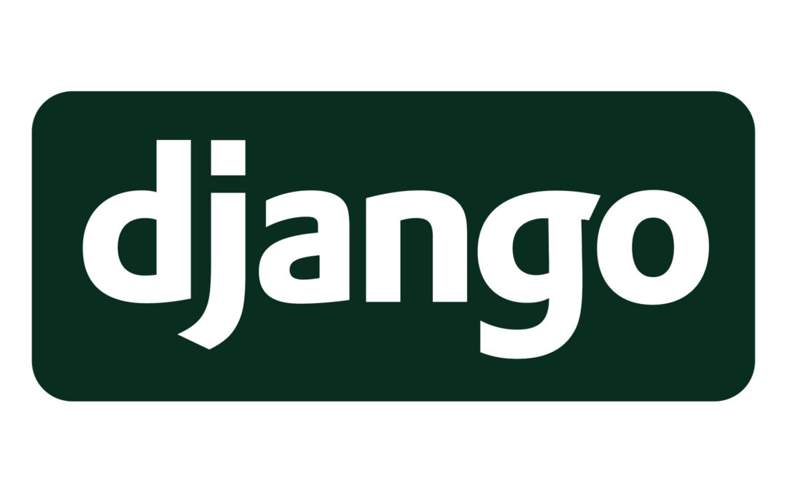  

> Django is named after Django Reinhardt, a jazz manouche guitarist ... Django is pronounced **JANG-oh**. Rhymes with FANG-oh. The “D” is silent. [source](https://docs.djangoproject.com/en/dev/faq/general/#what-does-django-mean-and-how-do-you-pronounce-it)

- <audio src="audios/django.mp3" controls=true></audio>

  

---

## Quixote

  

> Quixote is a framework for writing Web-based applications using Python

  

- Don **Quixote**
- 唐吉坷德
- <audio src="audios/quixote.mp3" controls=true></audio>

---

## Huey

  

> A little task queue for Python, Huey is named in honor of my cat. [source](https://github.com/coleifer/huey#project-page)

- /ˈhjuː.i/

  

---

## Sanic

  

  

> Sanic, a deliberate misspelling of "Sonic", refers ... Sonic the Hedgehog. [source](https://knowyourmeme.com/memes/sanic-hegehog)

- san-ic
- We have to go at **sanic** speeds.

---

## Sphinx

  

  

- /sfɪŋks/
- 斯芬克斯
- <audio src="audios/sphinx.mp3" controls=true></audio>

---

# Python Keywords

---

## [e]: l**a**ke

* del /del/
* def (definition, /ˌ**def**əˈnɪʃ(ə)n/)
* async (asynchronous, /**eɪ'sɪŋk**rənəs/)
  * asyncIO

## [ə]: **a**go

* as /əz/
* await /ə'weɪt/
* assert /ə'sɜrt/
  * VS asset /'**æ**set/

---

## [æ]: st**a**tic

* lambda /'l**æ**mdə/

## [ɑ]: st**o**p

* args (arguments)
  * kw**args** (keyword arguments)
  * Web**args**
* tuple <audio src="audios/tuple.mp3" controls=true></audio>

---

# Acronym and Combination

---

## WSGI

> The **W**eb **S**erver **G**ateway **I**nterface (WSGI, pronounced **whiskey** or **WIZ-ghee**) is a simple... [source](https://en.wikipedia.org/wiki/Web_Server_Gateway_Interface)

- /'wɪski/
- mod_wsgi
- uWSGI

## ASGI
##### **A**synchronous **S**erver **G**ateway **I**nterface

- /.ɑː'ski/

---

## SQL**Alchemy**

  

- SQL-Alchemy
- sequel-alchemy
- /'sikwəl/-/'ælkəmi/

## WT**Forms**

  

- W-T-Forms

---

## Tkinter

> The tkinter package ("**Tk** **inter**face") is the standard Python interface to the Tk GUI toolkit. [source](https://docs.python.org/3/library/tkinter.html)

- T-K-/'ɪntər/

## aiohttp

  

- A-I-O-H-T-T-P
- demo: [YouTube](https://youtu.be/OxzVApXKWYM?t=68) | [backup](https://youtu.be/pLyf1idJ4Lo?t=54)

---

# Uncategorized

* Bokeh /ˈboʊ.keɪ/ <audio src="audios/bokeh.mp3" controls=true></audio>
* Quart  /kwɔrt/ <audio src="audios/quart.mp3" controls=true></audio>
* Daphne /ˈdæfni/ <audio src="audios/daphne.mp3" controls=true></audio>
* Falcon /ˈfɑːl.kən/ <audio src="audios/falcon.mp3" controls=true></audio>
* PeeWee /'pi.wi/ <audio src="audios/peewee.mp3" controls=true></audio>
* Starlette <audio src="audios/starlette.mp3" controls=true></audio>
* Zope

---

<!-- _class: invert -->

# 正确发音很重要
##### 更重要的是不要有无所谓的态度

---

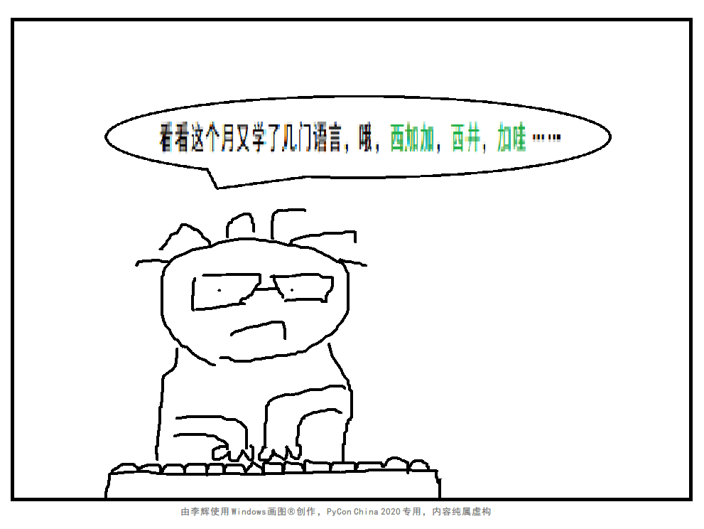  

---

<!-- _class: invert -->

# 请传播正确发音
##### 看，火把已经传到你的手上了

---

  

---

## 最后的建议

* 不要把拼音学的太好
* 不要嘲笑发错音的人
* 不要一味相信别人的发音，而要自己动手找正确发音

---

## 参考工具和资料

- [《美语音标》](https://book.douban.com/subject/4201317/)
- [Cambridge Dictionary](https://dictionary.cambridge.org/dictionary)
- [Forvo](https://forvo.com/)
- [How to Pronounce](https://howtopronounce.cc)
- [Google Translate](https://translate.google.com/)
- [YouTube](https://youtube.com)

---

# 谢谢

  

- greyli.com
- withlihui@gmail.com
- greyli.com/pronounce-python
- github.com/greyli/pronounce-python

##### submit feedback on [github](https://github.com/greyli/pronounce-python/issues)

 ---

# Credit & Copyright
- 幻灯片使用 [Marpit](https://marpit.marp.app/) 制作
- 大部分图片来自[维基百科](https://www.wikipedia.org/)
- 三幅~~漫画~~涂鸦和广告页的书封面由李辉使用 Windows 画图创作
- 大部分音频示例来自 [Forvo](https://forvo.com/)，少部分来自 [HowToPronounce](http://www.howtopronounce.cc/) 和 [Google Translate](https://translate.google.com/)
- Werkzeug 发音示例由其作者 [Armin Ronacher](https://lucumr.pocoo.org/) 贡献
- 项目 Logo 来自各自的网站/文档/GitHub 页面
- Sanic 图片来自 [Know Your Meme](https://knowyourmeme.com/)
- Flask logo 相关的两个图片来自 [Pixbay](https://pixabay.com/)
- 把标题里 Pronouce 中的 NOUN 大写的创意来自 [Adrian@ThiefMaster](https://github.com/ThiefMaster)
- 感谢 [Armin Roncher](https://lucumr.pocoo.org/)、[David Lord](https://davidism.com/) 和 [Frank Vieira](https://github.com/frnkvieira) 提供的帮助
